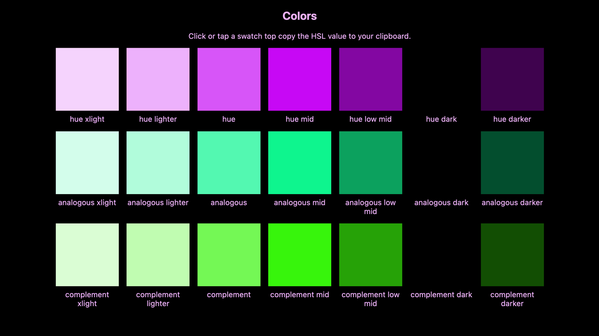

# Chromagen

Chromagen generates HSL color schemes.

- [Demo](https://chromagen.io)
- [Chromagen on GitHub](https://github.com/famebot/chromagen)
- [@famebot/chromagen on npm](https://www.npmjs.com/package/@famebot/chromagen)

[](https://www.npmjs.com/package/@famebot/chromagen) &nbsp; [](https://github.com/famebot/chromagen/issues)

## Installation and Usage

Chromagen uses [Microbundle](https://github.com/developit/microbundle) to produce ESM ([ECMAScript modules](https://nodejs.org/api/esm.html)), CJS ([CommonJS](https://nodejs.org/api/modules.html)), and UMD ([Universal Module Definition](https://github.com/umdjs/umd)) bundles that work in various environments.

### Node.js and similar environments

```bash
npm i @famebot/chromagen
```

```js
import chromagen from '@famebot/chromagen';
const colorScheme = chromagen();
console.log(colorScheme);
```

CommonJS `require` syntax:

```js
const chromagen = require('@famebot/chromagen');
const colorScheme = chromagen();
console.log(colorScheme);
```

### Browser use client-side

For browsers, use [unpkg](https://unpkg.com) or include `dist/chromagen.umd.js`, which `examples/browser/index.html` demonstrates. View the latest version at <https://chromagen.io>

Latest UMD bundle on unpkg:  
<https://unpkg.com/@famebot/chromagen/dist/chromagen.umd.js>

Using the UMD bundle in the browser:

```html
<script src="https://unpkg.com/@famebot/chromagen/dist/chromagen.umd.js"></script>
<script>
    const colorScheme = chromagen();
    console.log(colorScheme);
</script>
```

[](https://chromagen.io)

### Step by step

Any method above will return an object where the variable values below are randomized within acceptable parameters:

```js
{
  hue: 1,
  complement: 180,
  analogous: 226,
  saturation: 85,
  xlight: 85,
  lighter: 82,
  lightness: 71,
  midrange: 64,
  lowmid: 32,
  darkness: 17,
  darker: 9,
  huehsl: 'hsl(1, 85%, 71%)',
  complementhsl: 'hsl(180, 85%, 71%)',
  analogoushsl: 'hsl(226, 85%, 71%)',
  huexlighthsl: 'hsl(1, 85%, 85%)',
  huelighterhsl: 'hsl(1, 85%, 82%)',
  huemidhsl: 'hsl(1, 85%, 64%)',
  huelowmidhsl: 'hsl(1, 85%, 32%)',
  huedarkhsl: 'hsl(1, 85%, 17%)',
  huedarkerhsl: 'hsl(1, 85%, 9%)',
  complementxlighthsl: 'hsl(180, 85%, 85%)',
  complementlighterhsl: 'hsl(180, 85%, 82%)',
  complementmidhsl: 'hsl(180, 85%, 64%)',
  complementlowmidhsl: 'hsl(180, 85%, 32%)',
  complementdarkhsl: 'hsl(180, 85%, 17%)',
  complementdarkerhsl: 'hsl(180, 85%, 9%)',
  analogousxlighthsl: 'hsl(226, 85%, 85%)',
  analogouslighterhsl: 'hsl(226, 85%, 82%)',
  analogousmidhsl: 'hsl(226, 85%, 64%)',
  analogouslowmidhsl: 'hsl(226, 85%, 32%)',
  analogousdarkhsl: 'hsl(226, 85%, 17%)',
  analogousdarkerhsl: 'hsl(226, 85%, 9%)'
}
```

Check `src/index.js` for the nitty gritty.

## License

MIT
